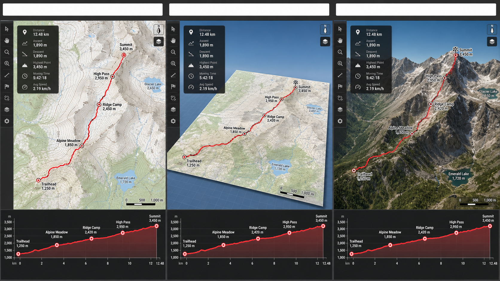

# Tile Endpoints and 3D Rendering

This is the single reference for GPXLister map endpoints and the rendering result selected by `3d_model`.



The illustration uses the same fictional alpine track in every panel so the rendering differences are clear:

| View                       | How it looks                                                                                                    | Terrain data          | Cost                                          |
| -------------------------- | --------------------------------------------------------------------------------------------------------------- | --------------------- | --------------------------------------------- |
| Flat 2D at startup         | Existing north-up Direct2D map with route, waypoints, overlays, and altitude/speed profiles                     | None                  | Lowest                                        |
| Perspective (`3d_model=1`) | The map is pitched and rotatable, but remains a geometrically flat plane                                        | None                  | Medium                                        |
| Real 3D (`3d_model=2`)     | The map is draped over a DEM mesh with raised hills and valleys; route, overlays, and profiles remain available | Terrarium or MapTiler | Highest, bounded and released on return to 2D |
| 3D unavailable             | GPXLister returns automatically to native flat 2D and displays a diagnostic banner                              | Unavailable           | Native 2D only                                |

Every file opens in flat 2D. The `3d_model` setting only chooses which renderer is started after pressing `D` or selecting **3D view (D)** from the map context menu. A missing or invalid setting is written as `3d_model=2`.

## Real-terrain endpoints

Terrarium is the default and needs no API key:

```ini
3d_model=2
terrainProvider=terrarium
terrariumTerrainEndpoint=https://s3.amazonaws.com/elevation-tiles-prod/terrarium/{z}/{x}/{y}.png
terrainExaggeration=1.0
```

MapTiler Terrain RGB is fully supported when a valid key and applicable MapTiler plan are available:

```ini
3d_model=2
terrainProvider=maptiler
mapTilerTerrainEndpoint=https://api.maptiler.com/tiles/terrain-rgb-v2/tiles.json?key={key}
mapTilerApiKey=YOUR_KEY
terrainExaggeration=1.0
```

## 2D basemap endpoint examples

| Style                  | Example endpoint                                                                                 | Notes                                                          |
| ---------------------- | ------------------------------------------------------------------------------------------------ | -------------------------------------------------------------- |
| OpenStreetMap Standard | `https://tile.openstreetmap.org/{z}/{x}/{y}.png`                                                 | Default general-purpose map; observe the OSM tile usage policy |
| OpenTopoMap            | `https://a.tile.opentopomap.org/{z}/{x}/{y}.png`                                                 | Contours and hill shading; no API key                          |
| CARTO Voyager          | `https://a.basemaps.cartocdn.com/rastertiles/voyager/{z}/{x}/{y}.png`                            | Clean raster basemap; check provider terms                     |
| Esri World Imagery     | `https://server.arcgisonline.com/ArcGIS/rest/services/World_Imagery/MapServer/tile/{z}/{y}/{x}`  | Satellite imagery using ArcGIS `{z}/{y}/{x}` order             |
| Esri World Topographic | `https://server.arcgisonline.com/ArcGIS/rest/services/World_Topo_Map/MapServer/tile/{z}/{y}/{x}` | Topographic raster map using ArcGIS tile order                 |
| MapTiler satellite     | `https://api.maptiler.com/tiles/satellite-v2/{z}/{x}/{y}.jpg?key=YOUR_KEY`                       | Requires a MapTiler API key                                    |

These endpoints are examples, not bundled services. Follow each provider's attribution, caching, rate-limit, and redistribution terms. GPXLister expands direct raster XYZ templates; provider-specific sessions, request headers, and vector-only endpoints are not supported by the native 2D renderer.
